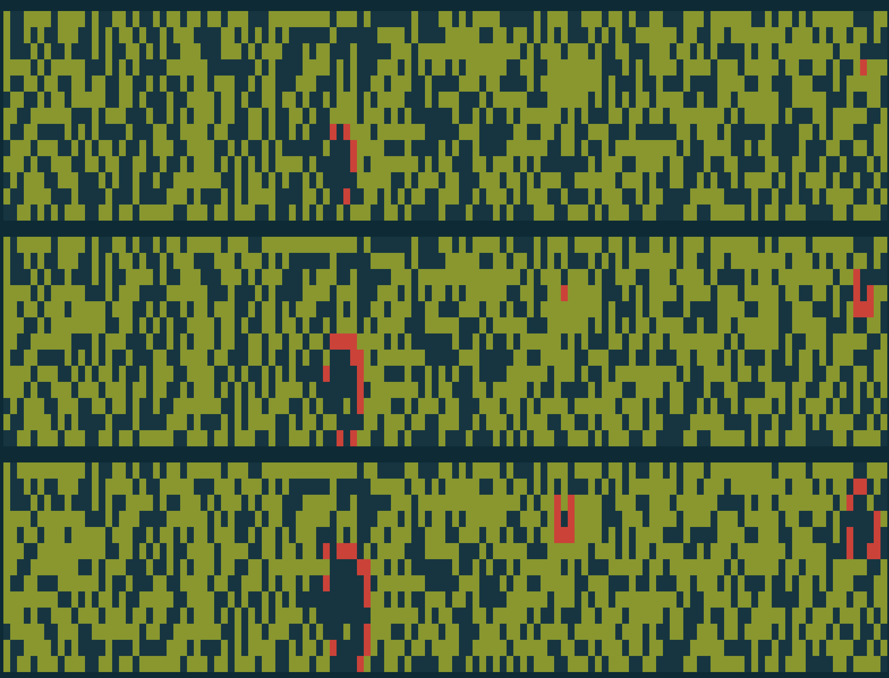

# forest-fire

## Simulation of a forest fire

This project simulates a forest fire based on simple rules. Here is an example of the output you can get.


The simulation is a cellular automaton. Here is a [wikipedia page](https://en.wikipedia.org/wiki/Forest-fire_model) about this kind of automaton.

## Rules

The forest is represented as a grid of cells which can be in defined states:

- empty: the cell is empty, there is no tree and the fire can't propagate through it.

- tree: the cell contains a tree. The tree will burn if a adjacent cell is containing a burning tree.

- burning: the cell contains a burning tree. The fire propagates to the adjacent cells.

## Install

To install the simulator, clone the repo and create a virtual environnement thanks to python-venv.
The version 3 of python is required.

Then, in the virtual environnement, run:

```console
(venv) $ pip install -r requirements.txt
```

## Usage

To run the simulation, run the script:

```console
(venv) $ python forest_fire.py
```

To get help:

```console
(venv) $ python forest_fire.py -h
```

## Tests

To run the tests, ensure to install the packages in requirements-tests.txt and then, run:

```console
(venv) $ python -m pytest
```

If you want to see the coverage report, run:

```console
(venv) $ python -m pytest --cov=src --cov-branch
```

To test the code with mutation testing, you can run mutmut with:

```console
(venv) $ python -m mutmut run
```

